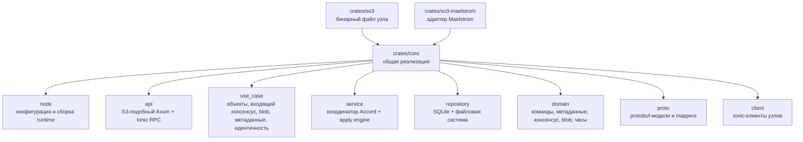
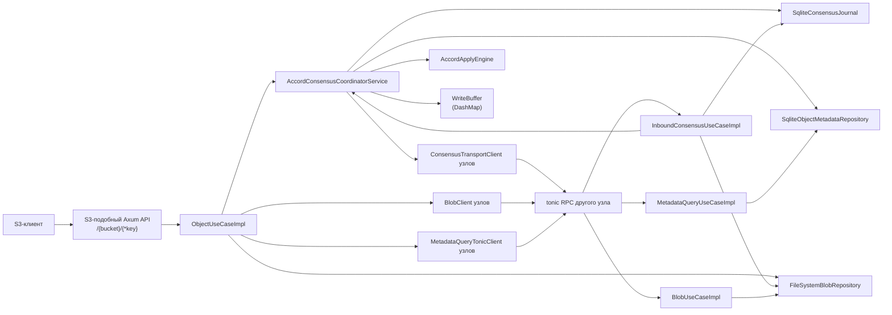
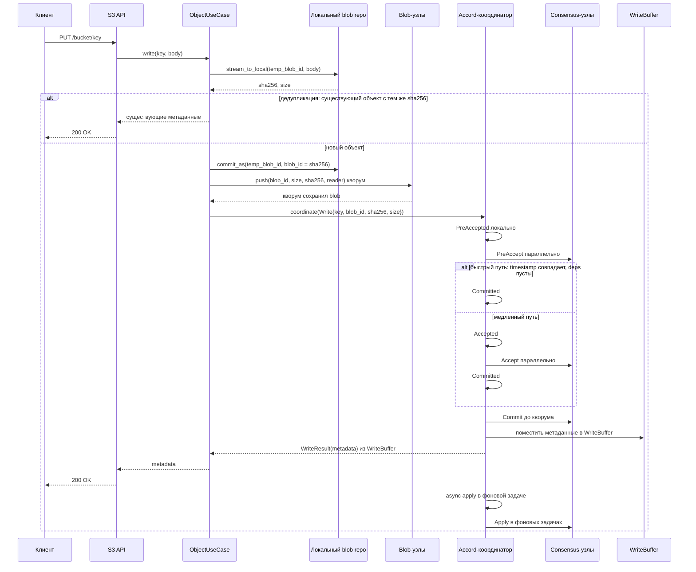
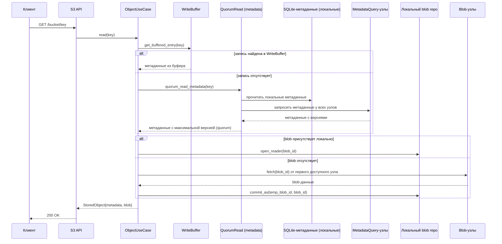
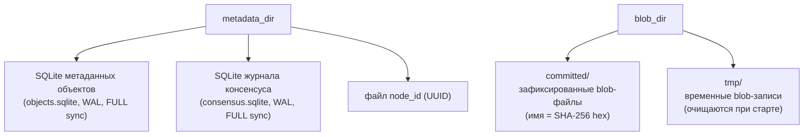
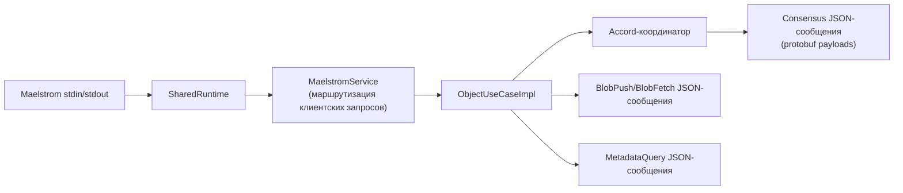

# Архитектура

Структура и потоки данных прототипа SO3 — распределённого объектного хранилища
с безлидерным Accord-подобным консенсусом.

## Структура workspace

## Узел SO3

`Node::new` собирает процесс следующим образом:

1. Через `RepositoryRegistry` открывает три хранилища: `SqliteObjectMetadataRepository`, `SqliteConsensusJournal` и
   `FileSystemBlobRepository`.
2. Создаёт по три tonic-клиента для каждого настроенного узла-партнёра: `ConsensusTransportClient` (с дедлайном),
   `BlobClient` и `MetadataQueryTonicClient`.
3. Восстанавливает объектные метаданные из уже применённых записей журнала (`reconcile_applied_metadata`): записи
   `Applied` сортируются по `timestamp`, и для каждой выполняется `store` или `delete` в репозиторий метаданных.
4. Обеспечивает устойчивую идентичность узла через `FileSystemNodeIdentityRepository`: если `node_id` не задан в
   конфигурации, генерируется новый UUID и сохраняется в файл `metadata_dir/node_id`.
5. Создаёт `AccordConsensusCoordinatorService`, который инициализирует счётчик `sequence` максимальным значением из
   журнала, заполняет reorder buffer из записей `Committed` и запускает фоновую задачу `recover_stalled_entries`.
6. Собирает `ObjectUseCaseImpl`, `InboundConsensusUseCaseImpl`, `MetadataQueryUseCaseImpl` и `BlobUseCaseImpl`.

`BoundNode::run` запускает два listener'а: публичный S3-подобный Axum API и приватный tonic RPC API. Обе задачи
выполняются параллельно; при ошибке любой из них другая отменяется через `CancellationToken`.

## S3-подобный API

Публичная HTTP-поверхность:

| Метод    | Маршрут            | Сценарий работы                                                              |
|----------|--------------------|------------------------------------------------------------------------------|
| `PUT`    | `/{bucket}/{*key}` | Сохранить тело как blob, отправить blob кворуму, скоординировать `Write`     |
| `GET`    | `/{bucket}/{*key}` | Quorum read метаданных, затем отдать локальный blob или восстановить от узла |
| `HEAD`   | `/{bucket}/{*key}` | Quorum read метаданных, вернуть только заголовки                             |
| `DELETE` | `/{bucket}/{*key}` | Скоординировать `Delete`                                                     |

Внутренний ключ объекта формируется как `bucket/key`. Ответы с метаданными включают:

- `etag`: SHA-256 digest в кавычках;
- `content-length`;
- `last-modified`;
- `x-amz-version-id`;
- `x-amz-object-size`;
- `x-amz-repository-class: STANDARD`.

## Поток записи

Blob сохраняется в два этапа: тело сначала записывается под временный `BlobId` (UUID v4), затем после вычисления SHA-256
фиксируется через `commit_as` под итоговым `BlobId`, производным от SHA-256 digest. Если существующий объект с данным
ключом уже содержит blob с совпадающим SHA-256, запись завершается немедленно без повторной консенсусной координации.

Blob-репликация выполняется параллельно: blob отправляется всем узлам одновременно через потоковый tonic-протокол (
`StoreBlobHeader` + `StoreBlobChunk` + `StoreBlobFooter`), выполнение продолжается при достижении кворума подтверждённых
записей. Принимающая сторона прерывает запись при несовпадении chunk digest, общего размера или итогового digest.

Координатор помещает результат в `WriteBuffer` (DashMap) до завершения консенсуса и возвращает клиенту метаданные из
буфера, не дожидаясь применения. Применение выполняется асинхронно в фоновой задаче. CAS-операции применяются синхронно
через `apply_with_recovery`.

## Поток чтения

Чтения (`GET`, `HEAD`) не проходят через координатор консенсуса. Сначала проверяется `WriteBuffer` координатора: если
для данного ключа имеется буферизованная запись, она возвращается немедленно. В противном случае выполняется quorum read
метаданных: локальные метаданные запрашиваются одновременно с метаданными всех узлов через `MetadataQueryTonicClient`,
из ответивших выбирается результат с наибольшей версией. Если blob отсутствует локально, он восстанавливается с одного
из узлов через `fetch_blob_from_any_peer`, который последовательно опрашивает узлы и записывает blob под временный ID с
последующим `commit_as`.

## Поток консенсуса

Координатор одновременно является репликой. Для каждой команды он:

1. Выделяет `CommandId { origin_node_id, sequence }`, где `sequence` — монотонно возрастающий счётчик, инициализируемый
   при старте из максимального значения в журнале.
2. Обновляет гибридные логические часы (HLC) через `tick(epoch, network_skew_ms)` и получает `timestamp_zero`. Параметр
   `network_skew_ms` добавляется к физической составляющей, снижая вероятность медленного пути.
3. Атомарно проверяет конфликты и записывает локальное состояние `PreAccepted` через
   `check_conflicts_and_record_pre_accepted`, получая локальные конфликтные зависимости.
4. Отправляет `PreAccept` другим узлам параллельно; прекращает при достижении кворума.
5. Определяет быстрый путь: если все ответившие peers (составляющие кворум) вернули `timestamp == timestamp_zero`,
   зависимости пусты и ни один узел не ответил NACK или ошибкой — фаза Accept пропускается.
6. Иначе записывает `Accepted` локально и отправляет `Accept` параллельно с quorum-driven early exit, объединяя
   зависимости из ответов. При получении NACK переходит к восстановлению.
7. Записывает `Committed`, отправляет `Commit` параллельно до ответа кворума (с ретраями до 10 попыток с
   экспоненциальной задержкой).
8. Для `Write` и `Delete`: помещает результат в `WriteBuffer` координатора, запускает применение через `ApplyEngine` в
   фоновой задаче и отправляет `Apply` другим узлам. После завершения применения запись удаляется из буфера по
   совпадению timestamp.
9. Для `Cas`: применяет синхронно через `apply_with_recovery` (с рекурсивным восстановлением зависимостей), затем
   отправляет `Apply` другим узлам.

Входящий обработчик (`InboundConsensusUseCaseImpl`) на каждом узле:

- `PreAccept`: если команда уже в состоянии `Accepted/Committed/Applied`, возвращает NACK. Иначе выполняет
  `accept_or_observe` на локальном HLC и записывает `PreAccepted` с обнаруженными конфликтами.
- `Accept`: записывает `Accepted` локально, если состояние позволяет продвижение.
- `Commit`: записывает `Committed`, регистрирует в reorder buffer и запускает `Apply` в фоновой задаче.
- `Apply`: проверяет наличие blob-данных (при необходимости загружает от партнёра) и делегирует применение
  `ApplyEngine`.
- `Recover`: возвращает локальное состояние журнала, зависимости и флаг `superseding` для записей в состоянии `Accepted`
  и выше.

## Apply Engine и reorder buffer

`AccordApplyEngine` обеспечивает корректный порядок применения при поступлении `Apply`-запросов с произвольным
упорядочением:

1. **Reorder buffer**: `DashMap<ObjectKey, BTreeMap<LogicalTimestamp, CommandId>>` — для каждого ключа хранит
   упорядоченный по timestamp набор ожидающих применения команд. При старте заполняется из записей `Committed` в
   журнале; при каждом новом `Commit` вызывается `register_committed`.
2. **Ожидание очереди**: перед применением команды engine проверяет reorder buffer на наличие команд с более ранним
   timestamp для того же ключа и ожидает их применения через `Notify`.
3. **Ожидание зависимостей**: затем проверяются явные зависимости из `DependencySet` — engine ожидает, пока все
   зависимости не перейдут в `Applied`.
4. **Блокировка ключа**: применяется мьютекс на уровне ключа для сериализации доступа к метаданным.
5. **Идемпотентность**: если команда уже в состоянии `Applied`, результат возвращается из журнала без повторного
   применения.
6. **Применение**: записывает `Applied` в журнал, затем выполняет побочный эффект — `store` для `Write/Cas.Updated` или
   `delete` для `Delete`.
7. **Уведомление**: после применения записи удаляются из reorder buffer, и ожидающие задачи уведомляются через
   `apply_notify`.

## Восстановление

При старте узла фоновая задача `recover_stalled_entries` выполняет три фазы:

1. **Фиксация stalled-записей**: записи в состоянии `PreAccepted` или `Accepted` проходят через `recover_and_commit` —
   определяется состояние на кворуме реплик, и если решение уже принято, используется оно; иначе выполняется Accept-фаза
   с recovery-баллотом.
2. **Применение зафиксированных**: все записи, переведённые в `Committed` при восстановлении, применяются в порядке
   timestamp.
3. **Повторное применение Committed**: записи в `Committed`, которые ещё не были `Applied` (например, blob был временно
   недоступен), повторяются.

Для восстановления по требованию (`recover_and_apply_stalled_chain`) при обнаружении stalled-зависимости во время
`apply_with_recovery` выполняется BFS по цепочке зависимостей: обнаруживаются все stalled и Committed-но-не-Applied
записи, stalled фиксируются через `recover_and_commit`, затем все применяются в порядке timestamp.

## Устойчивое состояние

Оба SQLite-репозитория используют WAL-режим, `SYNCHRONOUS=FULL`, `busy_timeout=5s` и пул соединений с
`max_connections=4`. Для журнала консенсуса создаются индексы по `(key, state)` и `(state)`.

Правила устойчивости:

- blob-байты фиксируются (`commit_as` + `sync_dir`) до того, как объектные метаданные начинают ссылаться на blob;
- результаты консенсуса журналируются до применения побочных эффектов к метаданным;
- при старте применённые записи журнала переигрываются в объектные метаданные в порядке timestamp;
- при неудаче blob-записи временный файл удаляется через `abort`; при старте все временные файлы очищаются;
- blob-файл при `commit_as` сначала проходит `sync_all`, затем атомарно переименовывается в committed-директорию с
  последующим `sync_dir`.

## Адаптер Maelstrom

`so3-maelstrom` повторно использует `so3-core`, но заменяет tonic-транспорт между узлами на JSON-сообщения stdin/stdout
Maelstrom:

Адаптер инициализируется сообщением `init` от Maelstrom, после чего строит тот же набор компонентов, что и
production-узел: `SqliteConsensusJournal`, `SqliteObjectMetadataRepository`, `FileSystemBlobRepository`,
`AccordConsensusCoordinatorService`, `InboundConsensusUseCaseImpl`. Транспортными клиентами служат
`MaelstromConsensusPeerClient`, `MaelstromBlobPeerClient` и `MaelstromMetadataQueryPeerClient`, которые отправляют
JSON-сообщения через stdout и ожидают ответы по `msg_id` через `oneshot`-каналы.

`MaelstromService` обрабатывает операции `read`, `write`, `cas`, `add` и `set_read`. CAS реализован как цикл: чтение
текущего значения → сравнение с `from` → `cas` с `expected_version`; при конфликте (`CasResult::Conflict`) цикл
повторяется.

Результаты экспериментов: [results.md](results.md).
