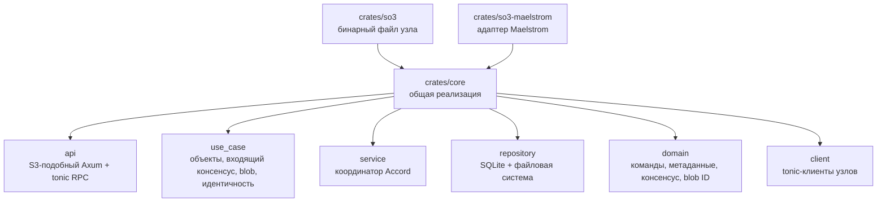
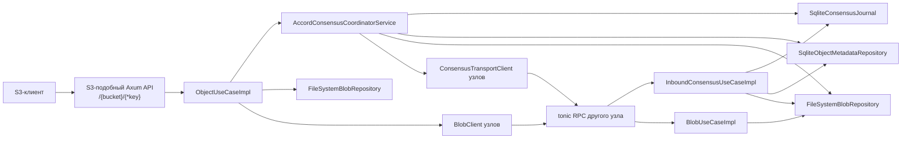
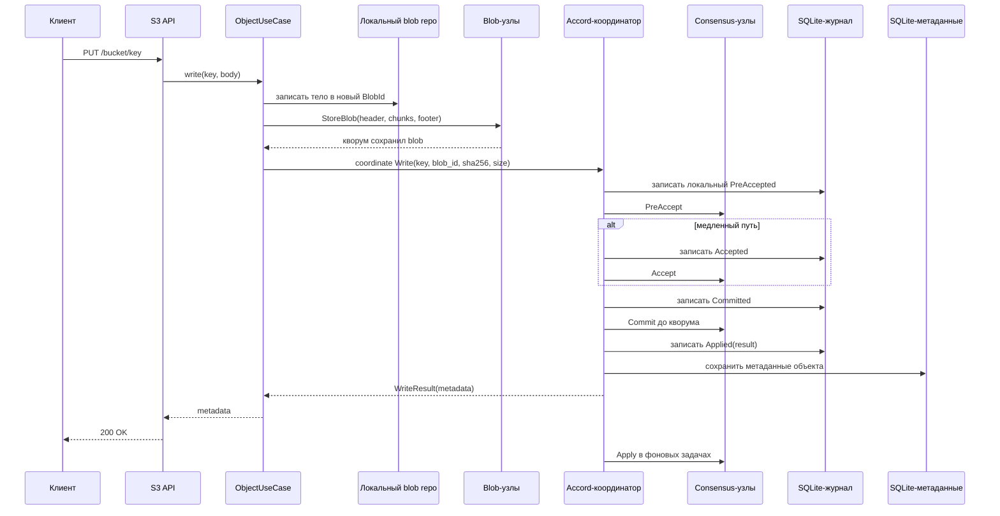
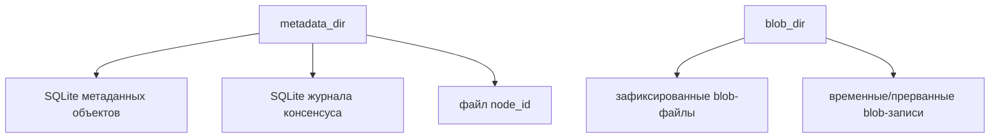
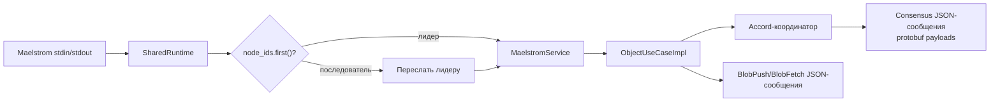

# Архитектура

Этот документ описывает текущую реализацию SO3, а не финальный промышленный дизайн.
Проект является исследовательским прототипом распределенного объектного хранилища с
репликацией на основе консенсуса без постоянного лидера.

## Структура workspace

## Узел SO3

`Node::new` собирает процесс следующим образом:

- открывает `SqliteObjectMetadataRepository`, `SqliteConsensusJournal` и `FileSystemBlobRepository`;
- создает tonic-клиенты консенсуса и blob-передачи для каждого настроенного узла;
- перед запуском API восстанавливает объектные метаданные из уже примененных записей журнала;
- обеспечивает устойчивую идентичность узла, генерируя `node_id`, если он не задан в конфигурации;
- в `BoundNode::run` запускает два listener'а: публичный S3-подобный Axum API и приватный tonic RPC API.

## S3-подобный API

Публичная HTTP-поверхность намеренно небольшая:

| Метод    | Маршрут            | Сценарий работы                                                              |
|----------|--------------------|------------------------------------------------------------------------------|
| `PUT`    | `/{bucket}/{*key}` | Сохранить тело как blob, отправить blob кворуму, скоординировать `Write`     |
| `GET`    | `/{bucket}/{*key}` | Скоординировать `Read`, затем отдать локальный blob или восстановить от узла |
| `HEAD`   | `/{bucket}/{*key}` | Скоординировать `Read`, вернуть только заголовки метаданных                  |
| `DELETE` | `/{bucket}/{*key}` | Скоординировать `Delete`                                                     |

Внутренний ключ объекта хранится в формате `bucket/key`. Ответы с метаданными включают:

- `etag`: SHA-256 digest в кавычках;
- `content-length`;
- `last-modified`;
- `x-amz-version-id`;
- `x-amz-object-size`;
- `x-amz-repository-class: STANDARD`.

## Поток записи

В production-узле передача blob-данных использует потоковый tonic-протокол:

- `StoreBlobHeader` объявляет `blob_id` и полный размер;
- каждый `StoreBlobChunk` несет байты и SHA-256 конкретного chunk'а;
- `StoreBlobFooter` несет SHA-256 всего объекта;
- принимающая сторона прерывает запись при несовпадении chunk digest, общего размера или итогового digest.

## Поток консенсуса

Координатор одновременно является репликой. Для каждой команды он:

1. Выделяет `CommandId { origin_node_id, sequence }`.
2. Обновляет hybrid logical clock и получает `timestamp_zero`.
3. Записывает локальное состояние `PreAccepted` и локальные конфликтные зависимости.
4. Отправляет `PreAccept` другим узлам.
5. Использует быстрый путь только если ответили все узлы, timestamp остался равен `timestamp_zero`,
   зависимости не найдены и ни один узел не завершился ошибкой.
6. Иначе записывает и отправляет `Accept`, объединяя зависимости из ответов.
7. Записывает `Committed`, повторяет `Commit` до ответа кворума, применяет команду локально и отправляет
   `Apply` другим узлам в фоновых задачах.

Восстановление реализовано через `Recover` RPC и `recover_and_complete`.

## Устойчивое состояние

Реализованные правила устойчивости:

- blob-байты фиксируются до того, как объектные метаданные начинают ссылаться на blob;
- результаты консенсуса журналируются до применения побочных эффектов к метаданным;
- при старте примененные записи журнала переигрываются в объектные метаданные в порядке timestamp.

Известный пробел: сгенерированная идентичность узла пока сохраняется обычной записью файла, без
атомарной замены и явного `fsync`.

## Адаптер Maelstrom

`so3-maelstrom` повторно использует `so3-core`, но заменяет tonic-транспорт между узлами на
JSON-сообщения stdin/stdout Maelstrom:

Важные отличия от production-узла:

- клиентские запросы, пришедшие на не-лидерные Maelstrom-узлы, пересылаются на `node_ids.first()`;
- production-бинарь `so3` позволяет любому узлу координировать запросы, пришедшие на его S3-подобный API;
- Maelstrom blob push/fetch передает один JSON payload и не валидирует объявленный размер и SHA-256 так,
  как это делает production tonic blob transport;
- карты ожидающих Maelstrom-запросов сейчас ждут oneshot-ответы без дедлайнов операций;
- Maelstrom CAS с `create_if_not_exists=true` выполняет read, затем write, поэтому create-if-missing
  не является атомарным при конкурентных create-операциях.

## Известные ограничения

Основные риски, которые остаются за рамками текущего прототипа:

- локальный `apply` координатора ждет явные зависимости, но не использует тот же reorder gate,
  что входящий `Apply`;
- `Accept` после пропущенного `PreAccept` может потерять локальные конфликтные зависимости,
  обнаруженные принимающей репликой;
- пути blob repair/fetch фиксируют полученные байты по `blob_id` без проверки ожидаемого размера и SHA-256;
- production tonic-клиенты и карты ожидающих Maelstrom-запросов не имеют дедлайнов на отдельные операции;

Полный список аудита, TODO и пробелов в тестировании находится в [../agents.md](../agents.md).
