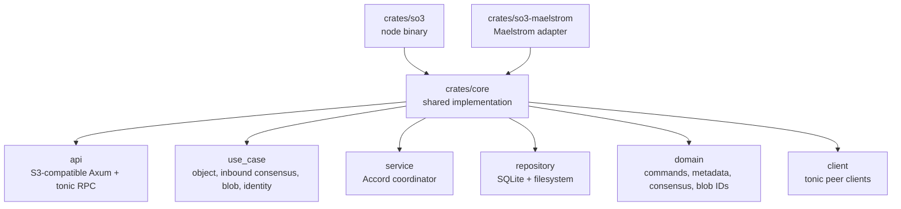
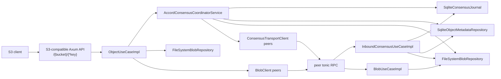
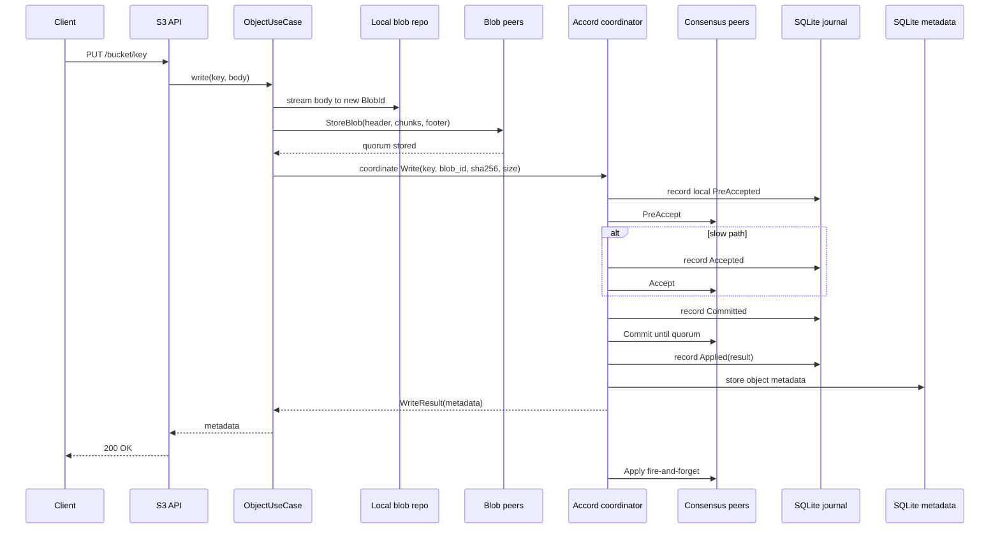
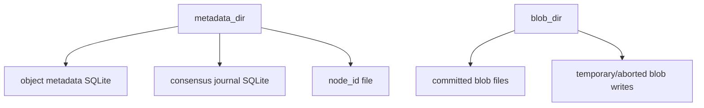
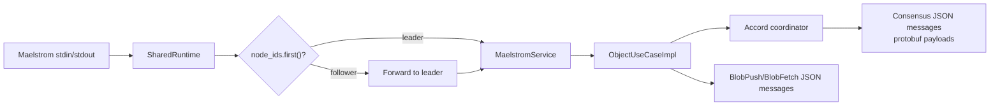

# Architecture

This document describes the current implementation, not the intended final design.

## Workspace Layout

## Production Node

`Node::new` wires the process as follows:

- Opens `SqliteObjectMetadataRepository`, `SqliteConsensusJournal`, and `FileSystemBlobRepository`.
- Builds tonic consensus and blob clients for every configured peer.
- Reconciles already-applied journal entries back into object metadata before serving.
- Ensures durable node identity, generating one when `node_id` is not configured.
- Starts two listeners in `BoundNode::run`: the public S3-compatible Axum API and private tonic RPC API.

## S3 API

The public HTTP surface is intentionally small:

| Method   | Route              | Use case                                                                |
|----------|--------------------|-------------------------------------------------------------------------|
| `PUT`    | `/{bucket}/{*key}` | Store request body as a blob, push blob to a quorum, coordinate `Write` |
| `GET`    | `/{bucket}/{*key}` | Coordinate `Read`, then stream local blob or repair from a peer         |
| `HEAD`   | `/{bucket}/{*key}` | Coordinate `Read`, return metadata headers only                         |
| `DELETE` | `/{bucket}/{*key}` | Coordinate `Delete`                                                     |

The object key stored internally is `bucket/key`. Metadata responses include:

- `etag`: quoted SHA-256 digest
- `content-length`
- `last-modified`
- `x-amz-version-id`
- `x-amz-object-size`
- `x-amz-repository-class: STANDARD`

## Write Flow

Blob transfer in production uses a streaming tonic protocol:

- `StoreBlobHeader` declares `blob_id` and total size.
- Each `StoreBlobChunk` carries bytes plus chunk SHA-256.
- `StoreBlobFooter` carries full-object SHA-256.
- The receiver aborts on chunk mismatch, total-size mismatch, or final digest mismatch.

## Consensus Flow

The coordinator is also a replica. For each command it:

1. Allocates `CommandId { origin_node_id, sequence }`.
2. Ticks the hybrid logical clock for `timestamp_zero`.
3. Records local PreAccepted state and local conflict dependencies.
4. Sends `PreAccept` to peers.
5. Uses the fast path only when every peer responds, the timestamp remains `timestamp_zero`, no dependencies are found,
   and no peer fails.
6. Otherwise records and sends `Accept`, merging dependencies from accept responses.
7. Records `Committed`, retries `Commit` until a quorum responds, applies locally, and sends peer `Apply` requests in
   background tasks.

Recovery exists (`Recover` RPC and `recover_and_complete`) but currently has known correctness gaps around local
recovery state and accepted-ballot selection. Treat the implementation as a prototype until those gaps are closed.

## Durable State

Durability rules currently implemented:

- Blob bytes are committed before object metadata references the blob.
- Consensus results are journaled before metadata side effects are applied.
- On startup, applied journal entries are replayed into object metadata in timestamp order.

Known durability gap: generated node identity persistence is a plain file write and is not yet atomic/fsynced.

## Maelstrom Adapter

`so3-maelstrom` reuses `so3-core` but replaces tonic peer transport with Maelstrom JSON messages:

Important differences from production:

- Client requests sent to non-leader Maelstrom nodes are forwarded to `node_ids.first()`.
- Production `so3` lets any node coordinate requests that arrive at its S3-compatible API.
- Maelstrom blob push/fetch sends one JSON payload and does not validate declared size or SHA-256 like production tonic
  blob transport.
- Maelstrom peer request maps currently wait on oneshot responses without operation deadlines.
- Maelstrom CAS with `create_if_not_exists=true` performs read then write, so create-if-missing is not atomic under
  concurrent creates.

## Known Limitations

Current high-priority risks tracked from the audit:

- Recovery counts the coordinator toward quorum without merging the coordinator's local accepted/committed/applied state
  into the recovered decision.
- Recovery responses do not expose accepted ballots, so recovery cannot choose the highest accepted value by ballot.
- Coordinator-local apply waits for explicit dependencies but does not use the inbound committed-command reorder gate.
- Accept after a missed PreAccept can discard local conflict dependencies discovered by the accepting replica.
- Blob repair/fetch paths commit fetched bytes by `blob_id` without verifying expected metadata size and SHA-256.
- Production tonic clients and Maelstrom pending maps lack per-operation deadlines.

See `AGENTS.md` at the repo root for the full audit checklist.
